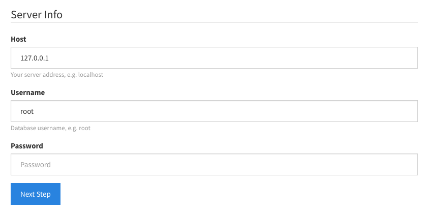
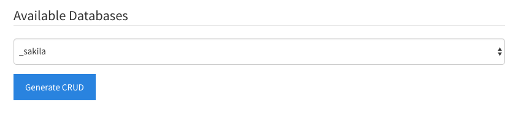
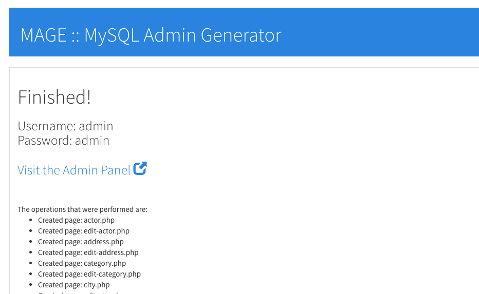
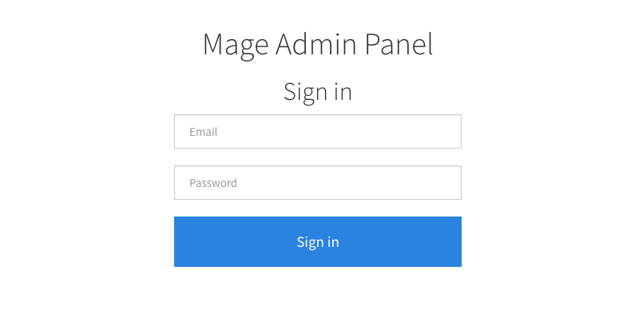
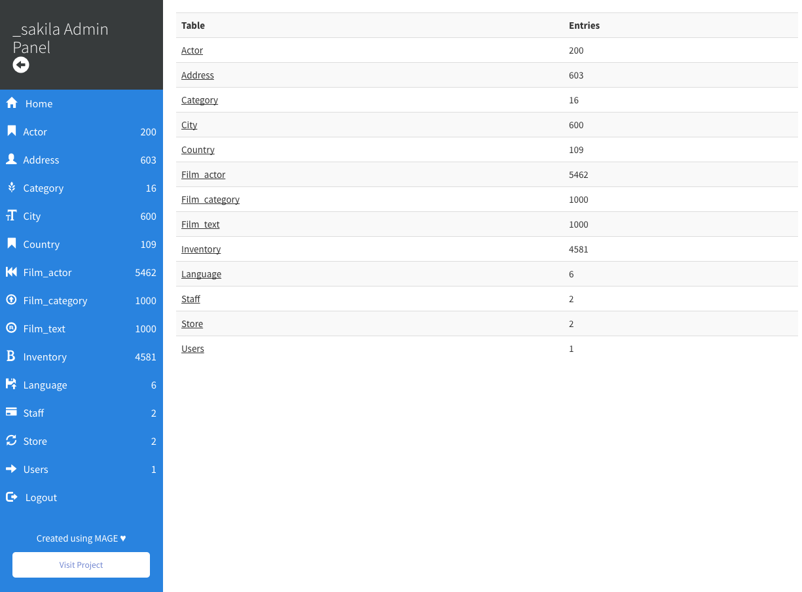
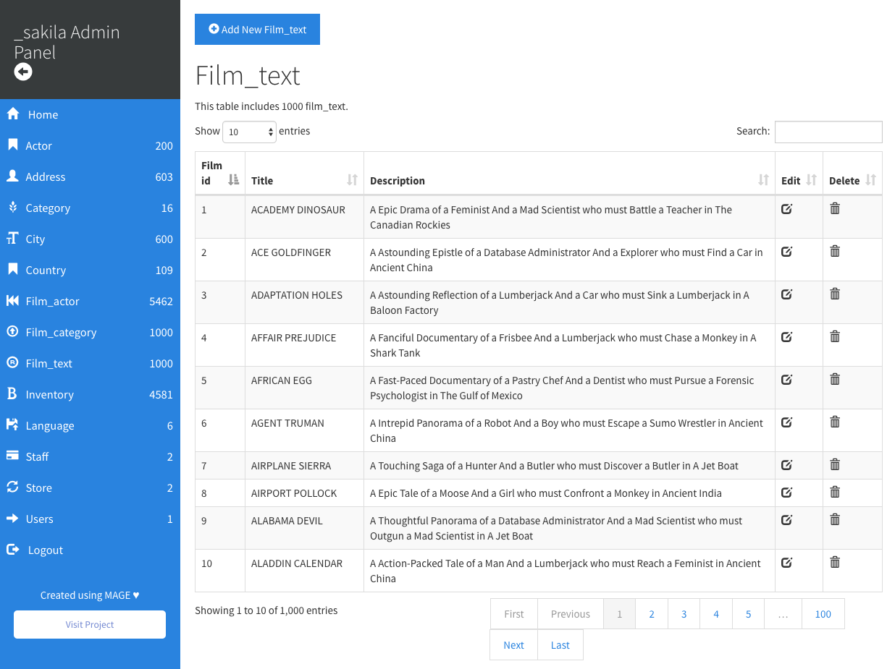
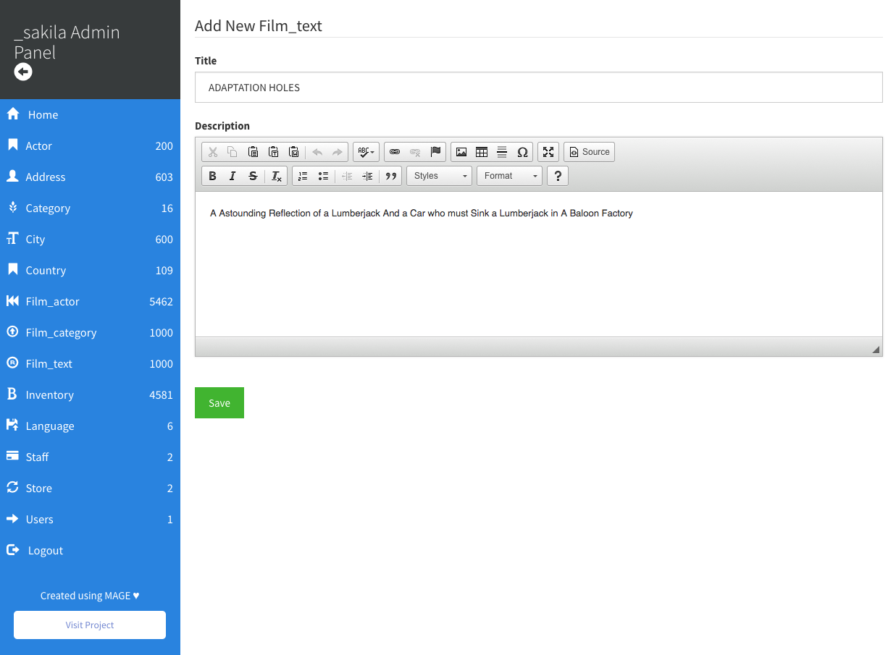

# MAGE :: PHP MySQL Admin Panel Generator
Available for Python also: [Python Mage](https://github.com/housamz/python-mysql-admin-panel-generator)

PHP MySQL Admin Panel Generator (MAGE), a PHP tool that helps you create a PHP Admin Panel for any MySQL database in seconds.

Mage is not PHPMyAdmin; it doesn't contain all your databases. It physically creates an admin panel for a database.

A suggested use-case for the tool would be creating an admin panel for a PHP / MySQL project in seconds, and then you can tweak it before delivery.

You may use this tool for charity or school projects, for commercial use, please contact me.

### Name
MAGE is derived from `M`ySql `A`dmin panel `GE`nerator.
Mage (meɪdʒ): a magician or learned person.

### Disclaimer: Always backup your database.

## Instructions:
***Note: You need to make sure that you have `php-mysql` package that connects PHP with MySQL, and that you change the `generated` directory permissions to be 777.***  

| Step | Thumb                                                                  | Instructions  |
| :--: |:----------------------------------------------------------------------:| :------------ |
|  1   | <a href="images/1.png" target="_blank"></a> | Start by providing your MySQL Server Info, then click Next Step button. |
|  2   | <a href="images/2.png" target="_blank"></a> | The tool will scan the server for available databases and list them in a dropdown menu, select the database that you want, then check if you need full HTML editor or not, and then click "Generate Admin Panel" button |
|  3   | <a href="images/3.png" target="_blank"></a> | After a few seconds, you'll get a success message, with a link to the newly created admin panel, and a report of all the operations that were done. |
|  4   | <a href="images/4.png" target="_blank"></a> | Click the link to the admin panel. You have to sign in using "admin" as an email and a password. |

You'll get a clean bootstrap interface to control the website, check below screenshots:  
<a href="images/5.png" target="_blank"></a>
<a href="images/6.png" target="_blank"></a>
<a href="images/7.png" target="_blank"></a>

## Notes
MAGE handles data using `htmlentities` as well as `addslashes` to prevent XSS attacks. This means that any HTML tags, especially those generated by the CKEditor, will be encoded.  
If you want to display the original HTML code use `html_entity_decode()` around that specific field.  
If you don't need HTML tags at all, you can disable CKEditor by unchecking the checkbox before clicking "Generate Admin Panel".

## Debugging:
#### Nothing happens when you provide credentials on home page
You need to install `php-mysql` package, the following installs the latest version.
```bash
sudo apt install php-mysql
service apache2 restart
```

#### Nothing happens when I click Generate button
Change the `generated` directory permission to 777
```bash
chmod 777 generated
```


